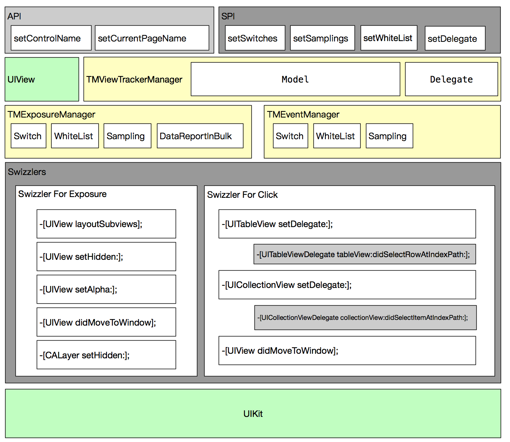

ViewTrackerSDK 技术文档
## 基本架构

## 原理介绍
### 点击事件
* 支持场景
    1. UIControl的UIControlEvents事件监听, 目前仅关注UIControlEventTouchUpInside。
    2. UIGestureRecognizer的拦截, 目前仅关注UITapGestureRecognizer。
    3. UITableView和UICollectionView的didSelect回调。

* 实现原理
    在恰当的时机，判断是否需要为该控件增加监听：
    >  1. 在UIView的`willMoveToWindow:`中，判断手势和target是否需要监听。
>   如果需要，则添加一个target来处理回调接口。
>    2. 在UITableView和UICollectionView的`setDelegate:`方法中，hook Delegate的didSelect方法， hook函数中判断是否需要回调接口。

### 曝光事件
* 支持场景
    页面切换，前后台切换，scrollview的滚动及自动滚动(包括UITableView和UICollectionView)。
    不支持view的覆盖，如UIAlertView、poplayer等。

* 实现原理
    拦截了UIView的`setAlpha:`、`setHidden:`、`didMoveToWindow`和`layoutSubviews`,以及CALayer的`setHidden:`方法。
    在以上这些时机，判断目标view的可见状态是否改变，并记录为扩展属性。
    当view的可见状态改变时，如果由不可见变为可见，则开始曝光，计算曝光开始时间；
    如果由可见变为可见，则认为结束曝光，此时计算曝光的持续时间，并根据各种设置判断是否需要回调接口。
    view的可见状态是由view是否隐藏、透明度、位置等属性来判断的。

    由于考虑到性能问题，未支持view遮挡的场景。
